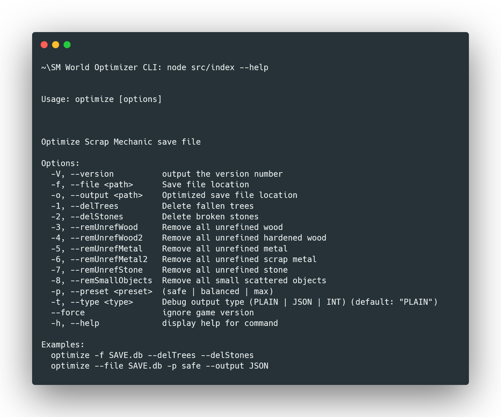
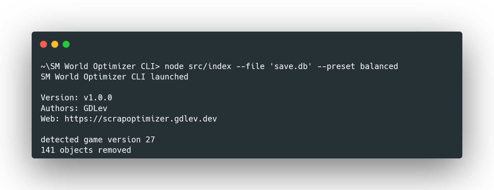

# SM World Optimizer

**SM World Optimizer** is an open-source tool designed to improve the performance of large **Scrap Mechanic** worlds by removing unnecessary and scattered objects that accumulate over time.

The goal of the tool is to restore the world to a usable and stable state when save files grow excessively large and performance degrades — even on high-end PCs.

## Versions

### Web Version
Available online: [https://scrapoptimizer.gdlev.dev](https://scrapoptimizer.gdlev.dev)  
Allows you to optimize your worlds directly in the browser.

### CLI (Command Line Interface)
Runs locally on your computer.  
Works on the same principle as the web version, but all operations are performed locally on your save files.

## How to Use the CLI
1. Clone the repository to your computer. `git clone https://github.com/GDLev/SMWorldOptimizer-CLI.git`
2. Install the necessary libraries `npm install`
3. Run the tool in your terminal according to the instructions below.

To get started, type `node src/index.js --help`

Example usage:

I know... there is no code from the website here, but it will change when the project becomes stable and I finish everything I have planned. At the moment I recommend using cli (it's the same code, but executed differently) or hosted version
---

**SM World Optimizer** helps keep your Scrap Mechanic worlds fast and stable, no matter how large they grow.
